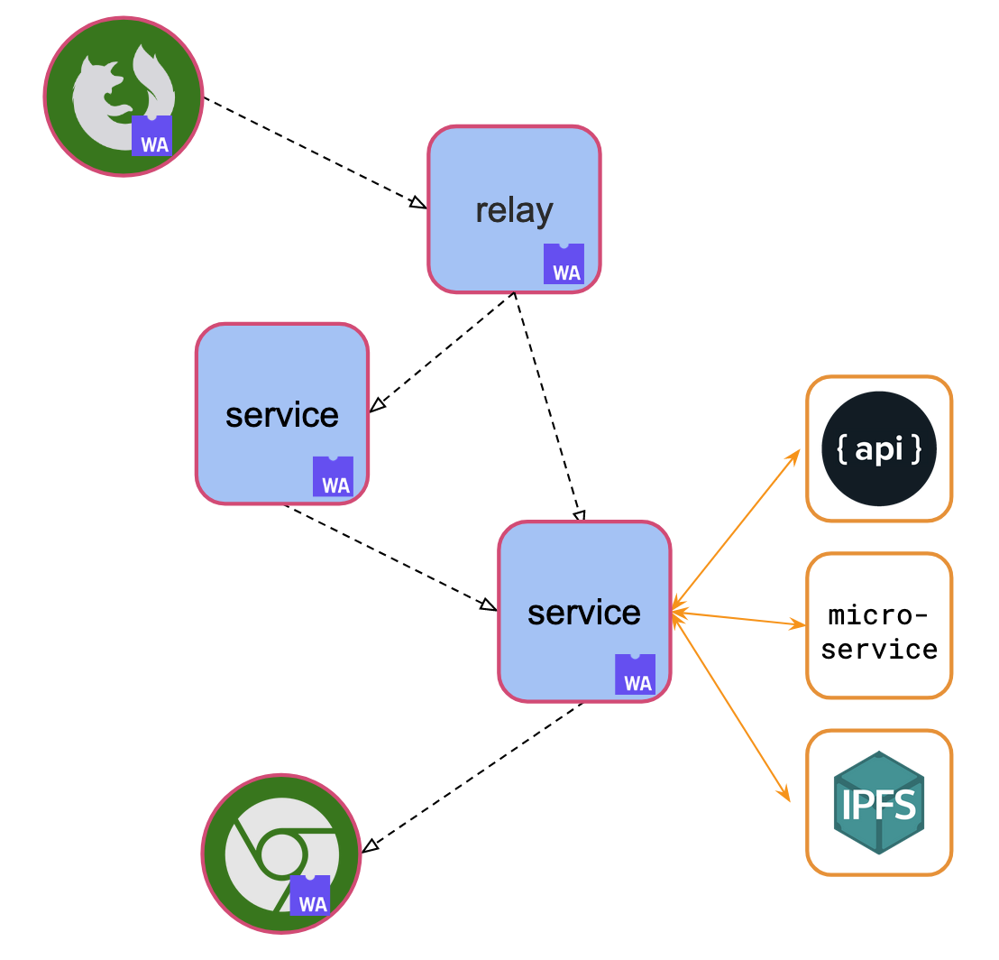
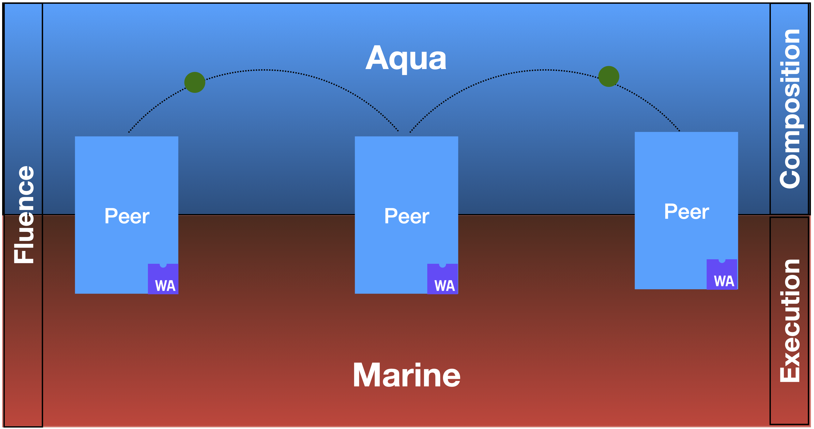

# Fluence

- Fluence is a peer-to-peer application platform which allows the creation of applications free of proprietary cloud providers or centralized APIss
- Fluence provides a peer-to-peer development stack so that you can program p2p applications, workflows and compose services, APIs without relying on the centralized intermediaries
- Aqua programming language which is used to program communication between peers
- Applications can be deployed onto the Fluence Network. It is live!

---

# Fluence peers

- Fluence network consists of **peers**, interconnected with **lib2p2**
- Peers can be publicly accessible or not:
  - Fully connected: **Rust** Fluence Node
  - Client: **TypeScript** Fluence Peers
- All peers host AquaVM, driving force that empowers p2p communication
- Particles are programmable message packages sent across the network

<!-- .element: style="max-width: 600px; float: left" -->



---

# P2P communication in Fluence



---

# TypeScript Peer implementation

**Provides everything required by the Fluence Protocol to participate in the networks**

- Connectivity with one or many Fluence Node which allows sending particles to and receiving from other Peers
- The Peer Id identifying the node in the network
- Aqua VM which allows the execution of air scripts inside particles
- A set of builtin functions required by Fluence protocol

---

# TypeScript Peer specifics

Contrary to Rust Fluence Node, JS peer:

- Participate in the network via a relay node
- Does not host Marine services (composed of wasm modules). Yet...
- Allows to implement services directly in TypeScript\JavaScript
- Allows to initiate Particles which provides ability for end-users to interact with the network
- Provides support for JS\TS Aqua compilation target

Note: Due to the limitations of browser-based environment `FluencePeer` cannot be discovered by it's Peer Id on it's own. To overcome this `FluencePeer` must use an existing node which will act as a `relay`. When a peer is connected through a `relay` it is considered to be `client`. The `FluencePeer` routes all it's particle through it's `relay` thus taking advantage of the peer discovery implemented on the node. A particle sent to the connected client must be routed through it's `relay`.

---

## Aqua compilation target. Services

aqua

```python
service HelloWorld("hello-world"):
    hello(str: string)
    getFortune() -> string
```

typescript, definition

```typescript
export interface HelloWorldDef {
  getFortune: (callParams: CallParams<null>) => string | Promise<string>;
  hello: (str: string, callParams: CallParams<"str">) => void | Promise<void>;
}
```

typescript, usage

```
registerHelloWorld({
  hello: (str) => {
    // ...
  },
  getFortune: async () => {
    // ...
  },
});
```

---

## Aqua compilation target. Functions

aqua

```python
func getRelayTime(relayPeerId: PeerId) -> u64:
    on relayPeerId:
        ts <- Peer.timestamp_ms()
    <- ts

func noReturn()
    on relayPeerId:
        Service.DoSomething()

```

typescript

```typescript
// getRelayTime usage
const time = await getRelayTime(relayNode.peerId);

// noReturn does not return values
await noReturn();
```

Warning: void function will not catch errors after particle is successfully sent! <!-- .element style="color: red" -->

---

## Aqua compilation target. Types

- **string** is converted to **string** in typescript
- **bool** is converted to **boolean** in typescript
- All number types (u8, u16, u32, u64, s8, s16, s32, s64, f32, f64) are converted to number in typescript
- optional types are converted to nullable (like **number?**)
- arrow types are converted to functions:

```
func callMeBack(callback: string, i32 -> ()):
    callback("hello, world", 42)
```

Callback will be converted to:

```
callback: (arg0: string, arg1: number, callParams: CallParams<'arg0' | 'arg1'>) => void | Promise<void>,
```

---

## fluence-js package: overview

- FluencePeer: the peer implementation
  - public interface
  - internal interface
- Default peer
  - for vast majority of use cases
- Fluence facade
  - wraps around the default peer
  - provides facade for common operations
- Aqua compiler support
  - registerService
  - callFunction
  - definitions

---

## fluence-js: Fluence facade

```typescript
export const Fluence = {
  start: (config?: PeerConfig): Promise<void> => {
    return defaultPeer.start(config);
  },

  stop: (): Promise<void> => {
    return defaultPeer.stop();
  },

  getStatus: () => {
    return defaultPeer.getStatus();
  },

  getPeer: (): FluencePeer => {
    return defaultPeer;
  },
};
```

---

## fluence-js: Fluence Peer public api

```typescript
export class FluencePeer {
  constructor() {}

  static isInstance(obj: FluencePeer): boolean {
    // ...
  }

  getStatus(): PeerStatus {
    // ...
  }

  async start(config?: PeerConfig): Promise<void> {
    // ...
  }

  async stop() {
    // ...
  }

  // ...
}
```

---

## fluence-js: Fluence Peer internal api

```typescript [6|9|10-15|19-24|28]
    /**
     * Is not intended to be used manually. Subject to change
     */
    get internals() {
        return {
            initiateParticle: (particle: Particle): void => {
                // ...
            },
            regHandler: {
                common: (
                    // force new line
                    serviceId: string,
                    fnName: string,
                    handler: GenericCallServiceHandler,
                ) => {
                    // ...
                },

                forParticle: (
                    particleId: string,
                    serviceId: string,
                    fnName: string,
                    handler: GenericCallServiceHandler,
                ) => {
                    // ...
                },

                timeout: (particleId: string, handler: () => void) => {
                    // ...
                },
            },
        };
    }
```

---

## fluence-js: Compiler support (1)

```typescript [1-5|6-11|12|14]
export function sayHello(
  targetPeerId: string,
  targetRelayPeerId: string,
  config?: { ttl?: number }
): Promise<string>;
export function sayHello(
  peer: FluencePeer,
  targetPeerId: string,
  targetRelayPeerId: string,
  config?: { ttl?: number }
): Promise<string>;
export function sayHello(...args: any) {
  let script = `...`;
  return callFunction(
    args,
    {
      functionName: "sayHello",
      returnType: {
        tag: "primitive",
      },
      argDefs: [
        //...
      ],
      names: {
        //...
      },
    },
    script
  );
}
```

---

## fluence-js: Compiler support (2)

````typescript [1-6|8|9-12|13-16|17-21|23|24]
export interface HelloPeerDef {
  hello: (
    from: string,
    callParams: CallParams<"from">
  ) => string | Promise<string>;
}

export function registerHelloPeer(service: HelloPeerDef): void;
export function registerHelloPeer(
  serviceId: string,
  service: HelloPeerDef
): void;
export function registerHelloPeer(
  peer: FluencePeer,
  service: HelloPeerDef
): void;
export function registerHelloPeer(
  peer: FluencePeer,
  serviceId: string,
  service: HelloPeerDef
): void;

export function registerHelloPeer(...args: any) {
  registerService(args, {
    defaultServiceId: "HelloPeer",
    functions: [
      {
        functionName: "hello",
        argDefs: [
          {
            name: "from",
            argType: {
              tag: "primitive",
            },
          },
        ],
        returnType: {
          tag: "primitive",
        },
      },
    ],
  });
}
```

---

## Building blocks for a frontend Fluence application

- Aqua code for peer-to-peer communication
- Compiler cli package: `@fluencelabs/aqua`
- TypeScript FluencePeer: `@fluencelabs/fluence`
- Javascript environment. Works both in nodejs and in all modern browsers
- Application specific code. No restriction on frameworks: you choose!

---

## Part 1. Installing dependencies

Fluence packages needed at runtime

```bash
npm install @fluencelabs/fluence @fluencelabs/fluence-network-environment
````

Aqua compiler and the standard library

```bash
npm install --save-dev @fluencelabs/aqua @fluencelabs/aqua-lib
```

To help automating compilation:

```bash
npm install --save-dev chokidar-cli
```

---

## Part 2. Setting up Aqua Compiler

After we installed the Aqua compiler it can be called from CLI:

```bash
npx aqua -i ./aqua/ -o ./src/_aqua
```

We recommend automating the building process:

```json
{
  ...
  "scripts": {
    ...
    "compile-aqua": "aqua -i ./aqua/ -o ./src/_aqua", // (1)
    "watch-aqua": "chokidar \"**/*.aqua\" -c \"npm run compile-aqua\"" // (2)
  },
  ...
}
```

Now aqua compilation can be run as follows:

```bash
npm run compile-aqua
```

---

## Part 3. Aqua Code

```[1|4-5|7-10]
import "@fluencelabs/aqua-lib/builtin.aqua"

-- The service runs inside browser
service HelloPeer("HelloPeer"):
    hello(from: PeerId) -> string

func sayHello(targetPeerId: PeerId, targetRelayPeerId: PeerId) -> string:
    on targetPeerId via targetRelayPeerId:
        res <- HelloPeer.hello(%init_peer_id%)
    <- res

```

---

## Part 4. Integrating into TypeScript code

```typescript [1|2|3|16|20-23|38]
import { Fluence } from "@fluencelabs/fluence";
import { krasnodar } from "@fluencelabs/fluence-network-environment";
import { sayHello, registerHelloPeer } from "./_aqua/getting-started";

const relayNodes = [krasnodar[0], krasnodar[1], krasnodar[2]];

function App() {
  const [isConnected, setIsConnected] = useState<boolean>(false);
  const [helloMessage, setHelloMessage] = useState<string | null>(null);

  const [peerIdInput, setPeerIdInput] = useState<string>("");
  const [relayPeerIdInput, setRelayPeerIdInput] = useState<string>("");

  const connect = async (relayPeerId: string) => {
    try {
      await Fluence.start({ connectTo: relayPeerId });
      setIsConnected(true);
      // Register handler for this call in aqua:
      // HelloPeer.hello(%init_peer_id%)
      registerHelloPeer({
        hello: (from) => {
          setHelloMessage("Hello from: \n" + from);
          return "Hello back to you, \n" + from;
        },
      });
    } catch (err) {
      console.log("Peer initialization failed", err);
    }
  };

  const helloBtnOnClick = async () => {
    if (!Fluence.getStatus().isConnected) {
      return;
    }

    // Using aqua is as easy as calling a javascript funсtion
    const res = await sayHello(peerIdInput, relayPeerIdInput);
    setHelloMessage(res);
  };
  // ...
}
```

---

# Demo time

<!-- .element: class="r-fit-text" -->

---

# Links

- fluence-js docs - [doc.fluence.dev](https://doc.fluence.dev/docs/fluence-js)
- project website - [fluence.network](https://fluence.network/)
- telegram - [t.me/fluence_dev](https://t.me/fluence_dev)
- discord - [fluence.chat](https://fluence.chat/)
- github - [fluencelabs](https://github.com/fluencelabs)

---

# Questions

?
